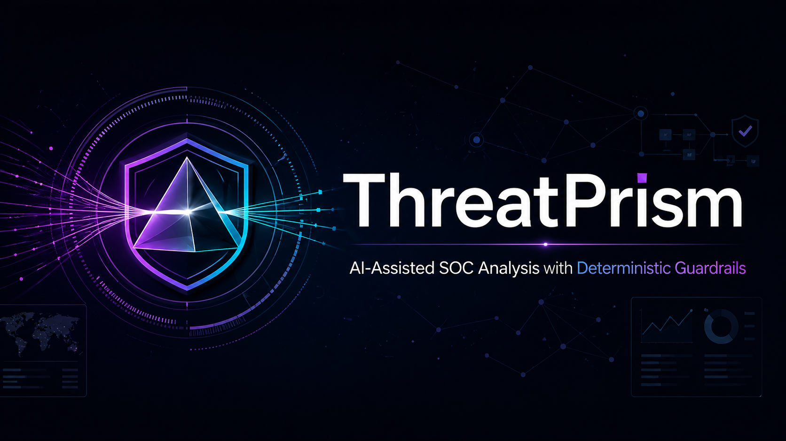

# Projects Page — Implementation Specification
**Portfolio:** `mwill20/ai-security-portfolio`
**Live URL:** https://mwill20.github.io/ai-security-portfolio/projects/index.html
**Prepared for:** AI Engineer implementation
**Status:** Approved — ready to build

---

## Context

This is a Flask + Frozen-Flask static site. Templates live in `/templates/`, the frozen static output lives in `/build/`. GitHub Pages serves from `/build/`. **Both the template source and the build output must be updated** for changes to go live.

The site was partially updated in a previous session. This spec covers the remaining changes required for the projects page only.

---

## Files to Modify

| File | Role |
|------|------|
| `templates/projects.html` | Jinja2 template source |
| `build/projects/index.html` | Static build output (what GitHub Pages serves) |
| `projects_data.py` | **No changes required** — already updated |

---

## Background: What's Already Done

The following were completed in a prior commit and should **not** be changed:

- `projects_data.py` no longer contains academic ML projects (FoodHub, Bank Churn, XGBoost, Visa Approval, Loan, SuperKart, SqueezeRadarAI)
- `projects_data.py` renamed `"fun"` category to `"tools"` and added KQL Sentinel Learning Lab
- `build/static/images/ThreatPrism.png` — hero banner image is uploaded and ready
- GitHub repo `purplelens-soc` has been renamed to `threatprism` at `https://github.com/mwill20/threatprism`

---

## Change 1 — Page Header Description

**Location:** `templates/projects.html` and `build/projects/index.html`

**Find:**
```html
<p class="section-description">A selection of my recent work spanning AI security, machine learning, and cybersecurity.</p>
```

**Replace with:**
```html
<p class="section-description">Production systems, AI security research, and SOC tooling — built under real operational constraints.</p>
```

---

## Change 2 — Filter Buttons

**Location:** The `<div id="all-projects" class="project-filters">` block in both files.

**Find (current buttons):**
```html
<button class="filter-btn active" data-filter="all">All</button>
<button class="filter-btn" data-filter="mcp">MCP Ecosystem</button>
<button class="filter-btn" data-filter="security">Security</button>
<button class="filter-btn" data-filter="agents">AI Agents</button>
<button class="filter-btn" data-filter="ml">ML Engineering</button>
<button class="filter-btn" data-filter="cloud">Cloud</button>
<button class="filter-btn" data-filter="fun">Just for Fun</button>
```

**Replace with:**
```html
<button class="filter-btn active" data-filter="all">All</button>
<button class="filter-btn" data-filter="mcp">MCP Ecosystem</button>
<button class="filter-btn" data-filter="security">Security</button>
<button class="filter-btn" data-filter="agents">AI Agents</button>
<button class="filter-btn" data-filter="cloud">Cloud</button>
<button class="filter-btn" data-filter="tools">Tools</button>
```

**Note:** `data-filter` values must exactly match the keys in `projects_data.py`: `mcp`, `security`, `agents`, `cloud`, `tools`. "ML Engineering" and "Just for Fun" are removed because those categories no longer exist in the data.

---

## Change 3 — Featured Section: Replace ThreatPrism Card

**Location:** The first `<div class="project-card featured">` inside `<section class="featured-projects">`.

This entire card currently describes "PurpleLens" and must be replaced in full. Replace the entire first featured card with the following:

```html
<!-- PROJECT 1: THREATPRISM -->
<div class="project-card featured"
    style="background: var(--bg-secondary); border: 1px solid var(--accent-color); padding: 40px; border-radius: 8px; margin-bottom: 40px; position: relative; overflow: hidden;">

    <!-- Badge -->
    <div
        style="position: absolute; top: 20px; right: 20px; background: rgba(100, 255, 218, 0.1); color: var(--accent-color); padding: 5px 15px; border-radius: 20px; font-family: var(--font-mono); font-size: 12px; border: 1px solid var(--accent-color);">
        PRODUCTION DEPLOYED
    </div>

    <!-- Hero Image -->
    <div style="margin-bottom: 30px; border-radius: 6px; overflow: hidden;">
        
    </div>

    <div class="project-header" style="flex-direction: column; align-items: flex-start;">
        <h3 style="font-size: 28px; margin-bottom: 10px;">ThreatPrism — Guardrail-First SOC Investigation Pipeline</h3>
        <p class="project-tagline"
            style="font-size: 18px; color: var(--text-secondary); margin-bottom: 25px;">
            AI-Assisted SOC Analysis with Deterministic Guardrails</p>
    </div>

    <div class="project-metric"
        style="display: flex; align-items: center; margin-bottom: 30px; background: rgba(10, 25, 47, 0.5); padding: 20px; border-radius: 8px;">
        <span class="metric-number"
            style="font-size: 48px; font-weight: 700; color: var(--accent-color); margin-right: 20px;">48%</span>
        <span class="metric-label" style="font-size: 16px; color: var(--text-primary);">reduction in analyst
            investigation time across 60+ enterprise clients</span>
    </div>

    <div class="project-details"
        style="display: grid; grid-template-columns: 1fr 1fr; gap: 40px; margin-bottom: 30px;">
        <div class="detail-section">
            <h4 style="color: var(--accent-color); margin-bottom: 15px;">The Chaos</h4>
            <p style="color: var(--text-secondary);">
                60+ enterprise clients. 3,000+ endpoints across US, APAC, and EU. Thousands of
                events weekly. T2 analysts spending 30–45 minutes per alert batch on work that
                was repetitive, manual, and beneath their skill level. Unsustainable at scale.
            </p>
        </div>

        <div class="detail-section">
            <h4 style="color: var(--accent-color); margin-bottom: 15px;">What I Built</h4>
            <p style="color: var(--text-secondary);">
                Engineered and deployed within Swimlane SOAR — an API-driven investigation pipeline
                that automatically extracts IOCs, maps TTPs to MITRE ATT&CK, generates severity and
                confidence scores, recommends next steps, and delivers structured analyst context
                before a human ever touches the alert.
            </p>
        </div>
    </div>

    <div class="detail-section" style="margin-bottom: 30px;">
        <div style="display: grid; grid-template-columns: 1fr 1fr; gap: 40px;">
            <div>
                <h4 style="color: var(--accent-color); margin-bottom: 15px;">Architecture Approach</h4>
                <p style="color: var(--text-secondary);">
                    Three-layer guardrail enforcement: (1) deterministic validation for
                    known patterns, (2) semantic schema enforcement preventing malformed
                    outputs, (3) policy-based controls enforcing organizational rules.
                    Each layer can independently veto outputs before they reach analysts.
                </p>
            </div>
            <div>
                <h4 style="color: var(--accent-color); margin-bottom: 15px;">Demonstrated Impact</h4>
                <ul style="color: var(--text-secondary); list-style: none;">
                    <li style="margin-bottom: 10px;"><i class="fas fa-check"
                            style="color: var(--accent-color); margin-right: 10px;"></i> 48% reduction in
                        MTTR (30–45 min → ~6 min per batch)</li>
                    <li style="margin-bottom: 10px;"><i class="fas fa-check"
                            style="color: var(--accent-color); margin-right: 10px;"></i> Zero hallucinated
                        actions through strict guardrail enforcement</li>
                    <li style="margin-bottom: 10px;"><i class="fas fa-check"
                            style="color: var(--accent-color); margin-right: 10px;"></i> Full auditability
                        with provenance tracking for compliance</li>
                    <li style="margin-bottom: 10px;"><i class="fas fa-check"
                            style="color: var(--accent-color); margin-right: 10px;"></i> Production-deployed
                        within Swimlane SOAR across MSSP environment</li>
                </ul>
            </div>
        </div>
    </div>

    <div class="note-box"
        style="background: rgba(100, 255, 218, 0.05); padding: 15px; border-left: 3px solid var(--accent-color); border-radius: 4px; margin-bottom: 30px; color: var(--text-secondary);">
        <strong style="color: var(--accent-color);">Note:</strong> GitHub contains the public POC demonstrating
        the full guardrail architecture and evaluation methodology. Operational deployment details
        within 11:11 Systems remain proprietary.
    </div>

    <div class="tech-stack" style="margin-bottom: 30px;">
        <span class="tech-tag"
            style="display: inline-block; background: rgba(100, 255, 218, 0.1); color: var(--accent-color); padding: 5px 15px; border-radius: 4px; border: 1px solid var(--accent-color); margin-right: 10px; margin-bottom: 10px; font-family: var(--font-mono); font-size: 13px;">Python</span>
        <span class="tech-tag"
            style="display: inline-block; background: rgba(100, 255, 218, 0.1); color: var(--accent-color); padding: 5px 15px; border-radius: 4px; border: 1px solid var(--accent-color); margin-right: 10px; margin-bottom: 10px; font-family: var(--font-mono); font-size: 13px;">LLM Guardrails</span>
        <span class="tech-tag"
            style="display: inline-block; background: rgba(100, 255, 218, 0.1); color: var(--accent-color); padding: 5px 15px; border-radius: 4px; border: 1px solid var(--accent-color); margin-right: 10px; margin-bottom: 10px; font-family: var(--font-mono); font-size: 13px;">Swimlane SOAR</span>
        <span class="tech-tag"
            style="display: inline-block; background: rgba(100, 255, 218, 0.1); color: var(--accent-color); padding: 5px 15px; border-radius: 4px; border: 1px solid var(--accent-color); margin-right: 10px; margin-bottom: 10px; font-family: var(--font-mono); font-size: 13px;">MITRE ATT&CK</span>
        <span class="tech-tag"
            style="display: inline-block; background: rgba(100, 255, 218, 0.1); color: var(--accent-color); padding: 5px 15px; border-radius: 4px; border: 1px solid var(--accent-color); margin-right: 10px; margin-bottom: 10px; font-family: var(--font-mono); font-size: 13px;">Provenance Tracking</span>
    </div>

    <div class="project-links">
        <a href="https://github.com/mwill20/threatprism" class="btn btn-primary"
            style="margin-right: 15px;" target="_blank"><i class="fab fa-github"></i> View on GitHub</a>
    </div>
</div>
```

**Note for build file:** The image path in the template uses `../static/images/ThreatPrism.png`. In `build/projects/index.html`, the path must be `../static/images/ThreatPrism.png` (same — both are in `/projects/` subdirectory relative to root).

---

## Change 4 — Featured Section: Card 2 (AI DevSecOps)

**No content changes.** The AI DevSecOps Platform card is correct as-is.

**One change only:** Confirm the badge text reads `PRODUCTION READY` (not `PUBLIC POC` or any variant). If it doesn't, update it.

---

## Change 5 — Featured Section: Add Card 3 (SecureCLI-Tuner)

**Location:** Insert immediately after the closing `</div>` of the AI DevSecOps Platform card, still inside `<section class="featured-projects">`.

```html
<!-- PROJECT 3: SECURECLI-TUNER -->
<div class="project-card featured"
    style="background: var(--bg-secondary); border: 1px solid var(--accent-color); padding: 40px; border-radius: 8px; margin-top: 40px; position: relative; overflow: hidden;">

    <!-- Badge -->
    <div
        style="position: absolute; top: 20px; right: 20px; background: rgba(100, 255, 218, 0.1); color: var(--accent-color); padding: 5px 15px; border-radius: 20px; font-family: var(--font-mono); font-size: 12px; border: 1px solid var(--accent-color);">
        SECURITY RESEARCH
    </div>

    <div class="project-header" style="flex-direction: column; align-items: flex-start;">
        <h3 style="font-size: 28px; margin-bottom: 10px;">SecureCLI-Tuner — Security-First LLM for Agentic DevOps</h3>
        <p class="project-tagline"
            style="font-size: 18px; color: var(--text-secondary); margin-bottom: 25px;">
            Translating natural language into safe, auditable Bash commands</p>
    </div>

    <div class="project-metric"
        style="display: flex; align-items: center; margin-bottom: 30px; background: rgba(10, 25, 47, 0.5); padding: 20px; border-radius: 8px;">
        <span class="metric-number"
            style="font-size: 48px; font-weight: 700; color: var(--accent-color); margin-right: 20px;">100%</span>
        <span class="metric-label" style="font-size: 16px; color: var(--text-primary);">adversarial attack
            blocking rate</span>
    </div>

    <div class="project-details"
        style="display: grid; grid-template-columns: 1fr 1fr; gap: 40px; margin-bottom: 30px;">
        <div class="detail-section">
            <h4 style="color: var(--accent-color); margin-bottom: 15px;">The Problem</h4>
            <p style="color: var(--text-secondary);">
                AI-generated shell commands create a dangerous attack surface in agentic DevOps
                pipelines. Traditional tools cannot distinguish between legitimate automation and
                prompt injection attempts. A single malformed command executed in production can
                cascade into a full breach.
            </p>
        </div>

        <div class="detail-section">
            <h4 style="color: var(--accent-color); margin-bottom: 15px;">The Solution</h4>
            <p style="color: var(--text-secondary);">
                Fine-tuned an LLM using sanitized QLoRA training data, then wrapped it in a
                three-layer runtime guardrail: (1) deterministic command validation, (2) semantic
                intent analysis, (3) policy enforcement blocking dangerous operations before
                execution. The model translates natural language to Bash while the guardrail
                stack intercepts any attempt to break out of safe behavior.
            </p>
        </div>
    </div>

    <div class="detail-section" style="margin-bottom: 30px;">
        <div style="background: rgba(10, 25, 47, 0.3); padding: 20px; border-radius: 6px;">
            <h5 style="color: var(--text-primary); margin-bottom: 10px;">Validation Results:</h5>
            <ul
                style="color: var(--text-secondary); list-style: none; display: grid; grid-template-columns: 1fr 1fr; gap: 10px;">
                <li><i class="fas fa-check-circle"
                        style="color: var(--accent-color); margin-right: 8px;"></i> 100% adversarial attack
                    blocking rate</li>
                <li><i class="fas fa-check-circle"
                        style="color: var(--accent-color); margin-right: 8px;"></i> 99.4% format compliance
                    on valid commands</li>
                <li><i class="fas fa-check-circle"
                        style="color: var(--accent-color); margin-right: 8px;"></i> Three independent
                    guardrail layers (Defense-in-Depth)</li>
                <li><i class="fas fa-check-circle"
                        style="color: var(--accent-color); margin-right: 8px;"></i> Built for production
                    CI/CD pipeline integration</li>
            </ul>
        </div>
    </div>

    <div class="tech-stack" style="margin-bottom: 30px;">
        <span class="tech-tag"
            style="display: inline-block; background: rgba(100, 255, 218, 0.1); color: var(--accent-color); padding: 5px 15px; border-radius: 4px; border: 1px solid var(--accent-color); margin-right: 10px; margin-bottom: 10px; font-family: var(--font-mono); font-size: 13px;">Python</span>
        <span class="tech-tag"
            style="display: inline-block; background: rgba(100, 255, 218, 0.1); color: var(--accent-color); padding: 5px 15px; border-radius: 4px; border: 1px solid var(--accent-color); margin-right: 10px; margin-bottom: 10px; font-family: var(--font-mono); font-size: 13px;">QLoRA Fine-Tuning</span>
        <span class="tech-tag"
            style="display: inline-block; background: rgba(100, 255, 218, 0.1); color: var(--accent-color); padding: 5px 15px; border-radius: 4px; border: 1px solid var(--accent-color); margin-right: 10px; margin-bottom: 10px; font-family: var(--font-mono); font-size: 13px;">LLM Guardrails</span>
        <span class="tech-tag"
            style="display: inline-block; background: rgba(100, 255, 218, 0.1); color: var(--accent-color); padding: 5px 15px; border-radius: 4px; border: 1px solid var(--accent-color); margin-right: 10px; margin-bottom: 10px; font-family: var(--font-mono); font-size: 13px;">Bash Safety</span>
        <span class="tech-tag"
            style="display: inline-block; background: rgba(100, 255, 218, 0.1); color: var(--accent-color); padding: 5px 15px; border-radius: 4px; border: 1px solid var(--accent-color); margin-right: 10px; margin-bottom: 10px; font-family: var(--font-mono); font-size: 13px;">Pydantic</span>
    </div>

    <div class="project-links">
        <a href="https://github.com/mwill20/SecureCLI-Tuner" class="btn btn-primary"
            style="margin-right: 15px;" target="_blank"><i class="fab fa-github"></i> View on GitHub</a>
    </div>
</div>
```

---

## Change 6 — Filter JavaScript

**Location:** The `<script>` block at the bottom of both files.

**Find this comment and stale logic:**
```javascript
// If filter is 'all', 'security' (since PurpleLens/DevSecOps are likely security), 
// show featured.
if (filter === 'all' || filter === 'security') {
```

**Replace the comment only** (keep the logic identical):
```javascript
// Featured section contains ThreatPrism, AI DevSecOps, and SecureCLI-Tuner — all security.
// Show featured on 'all' or 'security' filter.
if (filter === 'all' || filter === 'security') {
```

---

## Change 7 — Featured Section Header

**Find:**
```html
<h2 style="margin-bottom: 40px; border-bottom: 2px solid var(--accent-color); padding-bottom: 10px;">
    Featured: Production-Deployed Systems</h2>
```

**Replace with:**
```html
<h2 style="margin-bottom: 40px; border-bottom: 2px solid var(--accent-color); padding-bottom: 10px;">
    Featured: Production Systems & Security Research</h2>
```

---

## Build File Notes

The `build/projects/index.html` file is a frozen static render of the template. It does **not** use Jinja2 syntax — all template variables are already resolved. When applying changes to the build file:

- Replace `{{ url_for('static', filename='...') }}` paths with relative paths (e.g., `../static/images/ThreatPrism.png`)
- The build file already uses relative static paths (e.g., `../static/css/style.css`) — match that pattern
- The ``, `` loops are already rendered — do not add Jinja2 syntax to the build file
- The `projects_data.py` loop in the template renders the Security, Agents, Cloud, and Tools grids — in the build file these are already hardcoded HTML. SecureCLI-Tuner will appear in both the new featured card AND the Security grid (intentional — featured shows full write-up, grid is quick-reference)

---

## Validation Checklist

After pushing both files, confirm the following at the live URL:

- [ ] Filter buttons show: All · MCP Ecosystem · Security · AI Agents · Cloud · Tools (no ML Engineering, no Just for Fun)
- [ ] ThreatPrism card shows badge "PRODUCTION DEPLOYED" (not "PUBLIC POC")
- [ ] ThreatPrism hero image (`ThreatPrism.png`) renders below the badge
- [ ] ThreatPrism GitHub button links to `https://github.com/mwill20/threatprism`
- [ ] AI DevSecOps card unchanged, badge reads "PRODUCTION READY"
- [ ] SecureCLI-Tuner appears as third featured card with metric "100%"
- [ ] SecureCLI-Tuner GitHub button links to `https://github.com/mwill20/SecureCLI-Tuner`
- [ ] Filtering by "Security" shows featured section + Security grid
- [ ] Filtering by "Tools" hides featured section, shows KQL Sentinel Lab and Python-Dojo
- [ ] Filtering by "ML Engineering" or "Just for Fun" — these buttons should not exist
- [ ] No broken links or 404s on GitHub buttons

---

## Notes for Implementer

- **Do not modify** `projects_data.py` — it is correct as committed
- **Do not remove** SecureCLI-Tuner from the Security grid in `projects_data.py` — appearing in both featured and grid is intentional
- The `SageVault` project in the security grid links to `/sagevault` — this is a known placeholder route; leave it unchanged
- The site uses CSS variables (`--accent-color`, `--bg-secondary`, `--text-secondary`, etc.) defined in `static/css/style.css` — all inline styles in this spec use those variables correctly
- GitHub Pages rebuild takes approximately 60 seconds after push
